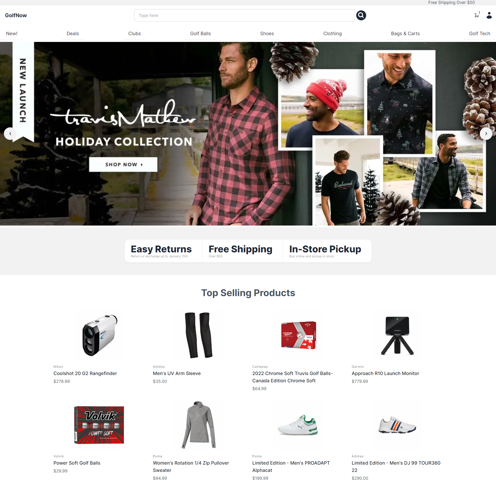
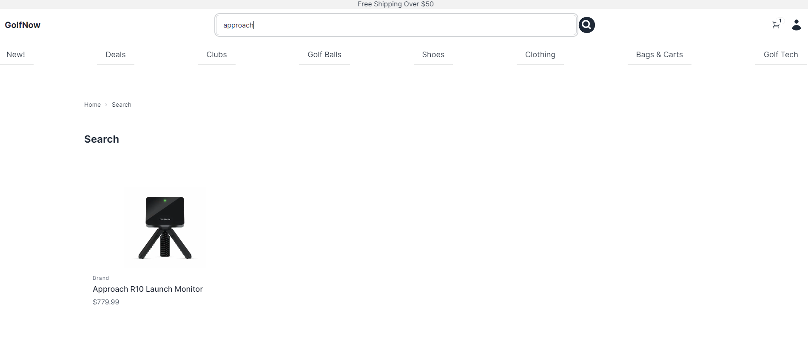
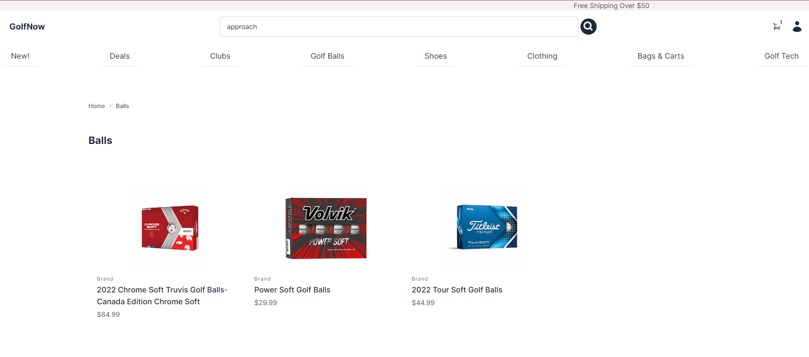
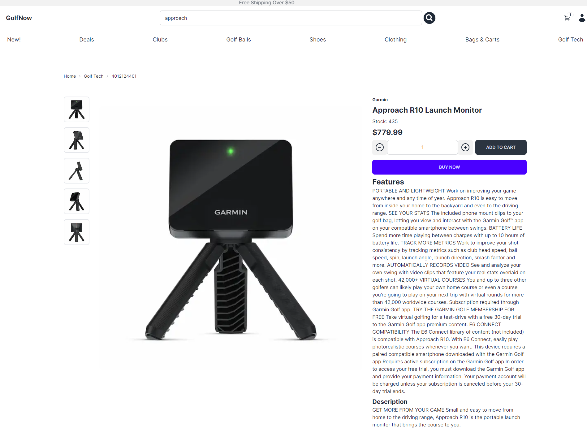
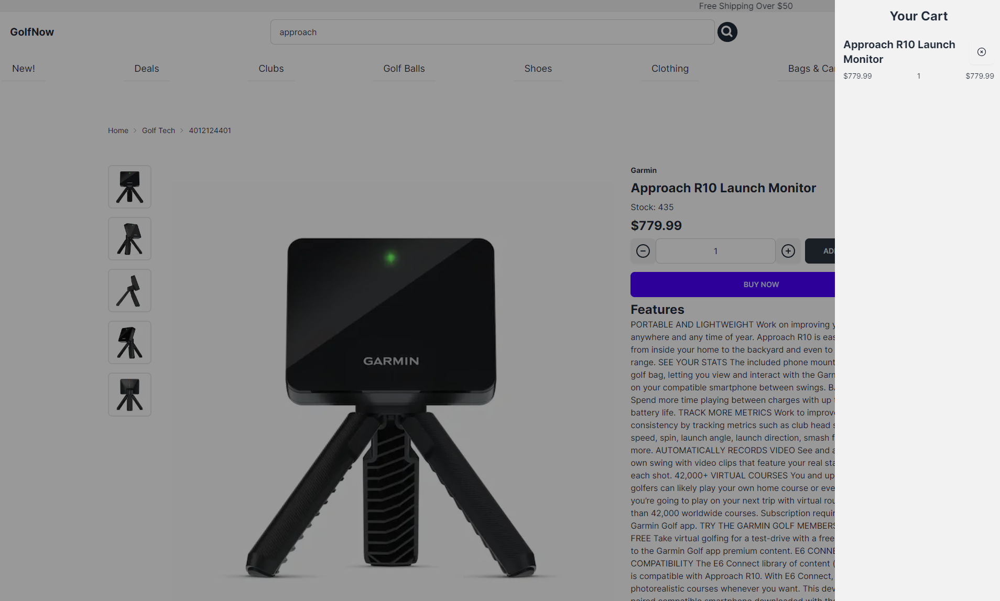
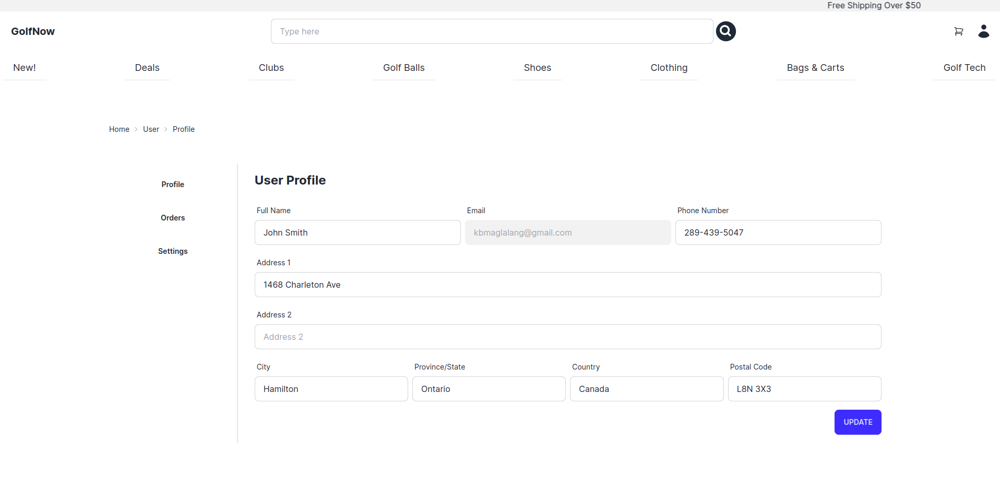
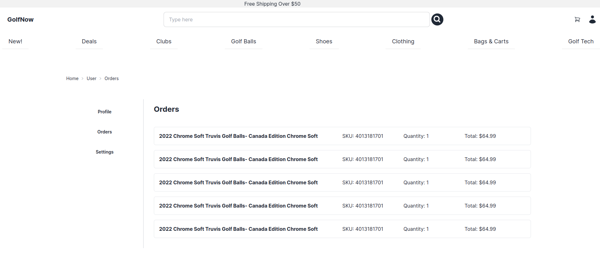
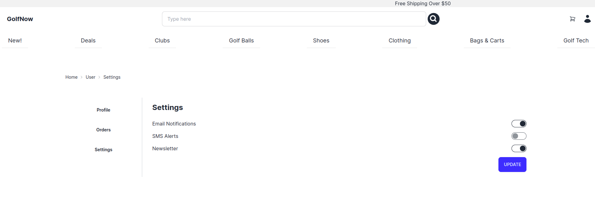
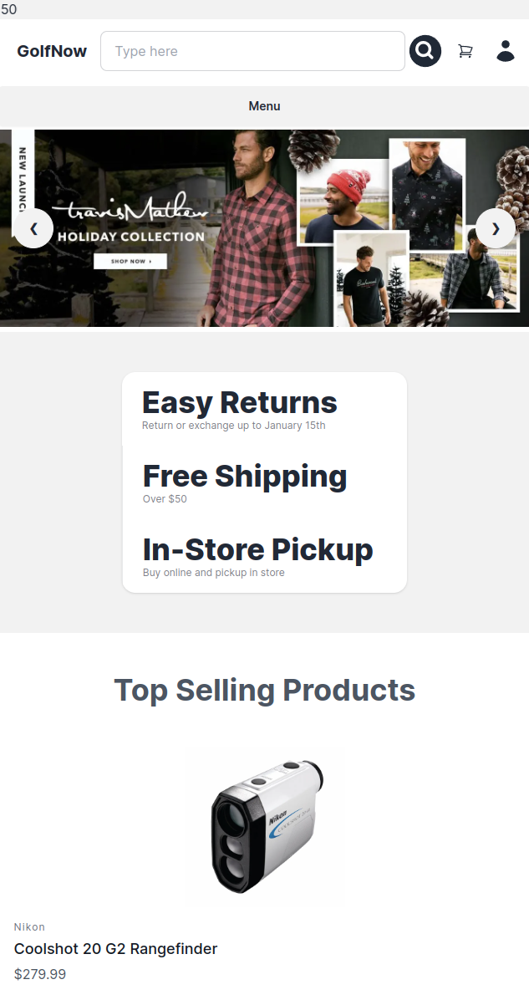

# GolfNow - eCommerce Store

GolfNow is a dynamic ecommerce platform focused on providing everything golf-related to enthusiasts of the sport. The website offers a comprehensive range of golf accessories and equipment, brought to life using several state-of-the-art web technologies.

## Description

### Key Features:

- User Authentication: Users can easily sign up and log in to GolfNow using their Google accounts through NextAuth.
- Product Listings: The website offers a wide variety of golf products. Users can search and browse to find the exact items they're looking for.
- Shopping Cart: Users can select products, add them to their cart and view their selected items before proceeding to checkout.
- Secure Payment Processing: Integrated Stripe provides a safe and hassle-free payment experience.
- Content Management: Sanity.io is used for managing website content such as product listings, descriptions, and other relevant information.
- Optimized Performance: Leveraging the power of Next.js, the website offers fast loading times and an efficient browsing experience.

### Technologies Used:

- Next.js: A high-performance React framework used for server-side rendering, enabling rapid website loading and efficient performance.
- Tailwind CSS and Daisy UI: Utilized for rapid development and easy styling of components. Daisy UI, a plugin for Tailwind CSS, further enhances the aesthetics of the user interface.
- NextAuth: Used for secure and reliable user authentication, allowing users to log in using their Google accounts.
- Sanity.io: A robust headless CMS adopted for flexible content management on the website.
- Prisma: An open-source database toolkit used for interfacing with a PostgreSQL database, simplifying database access and management.
- Stripe: Incorporated for seamless and secure payment processing, letting users make safe online transactions.
- TypeScript: The programming language of choice for this project, which provides static typing and improved code maintainability.

## Screenshots

## Getting Started

### Install

1. Clone the repository: `git clone https://github.com/KBMaglalang/golf-now`
2. Navigate to the project directory: `cd golf-now`
3. Install the necessary packages: `npm install` or `npm i`
4. Copy the `.env.example` file. You can create either `.env.local` or `.env` based on your preference
5. Open the newly created .env or .env.local file and populate the fields with the required values. Ensure the necessary permissions are granted for any services or APIs you're connecting to.

### Run

1. Run `npm run dev`
2. Click on the link shown in the terminal, usually `localhost:3000`
