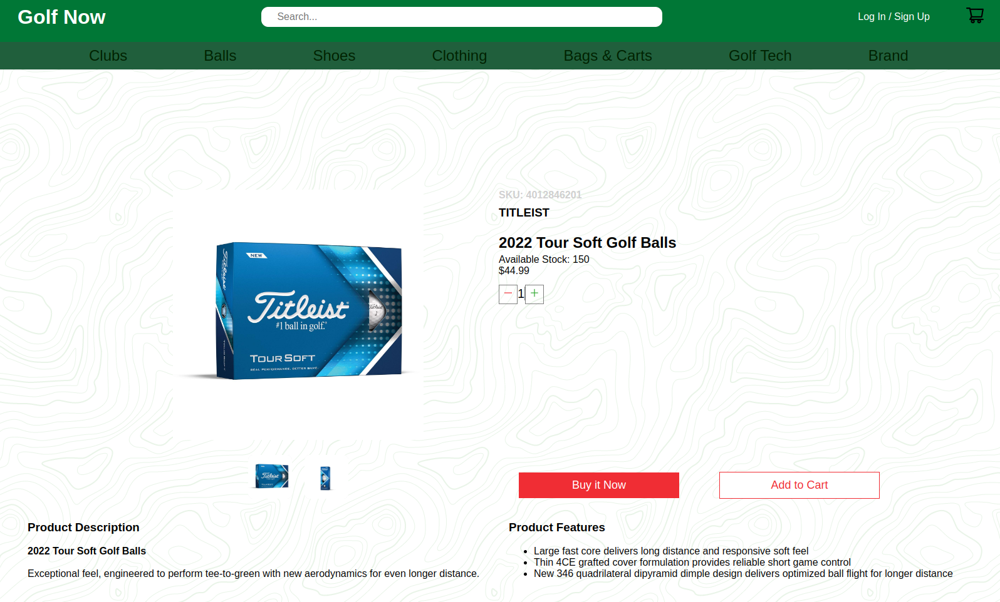
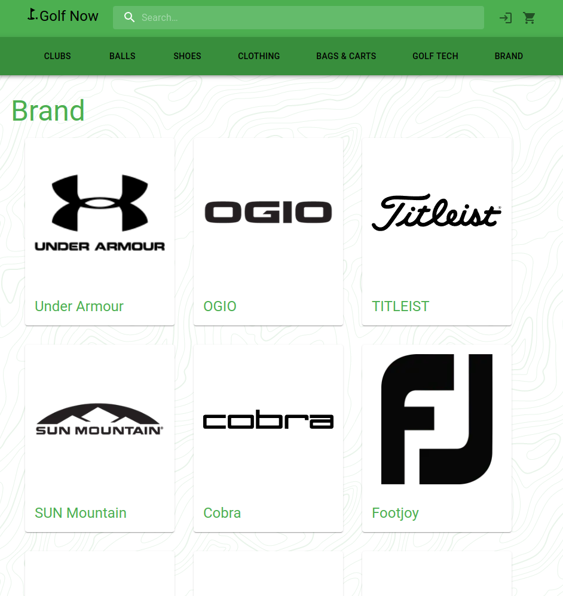
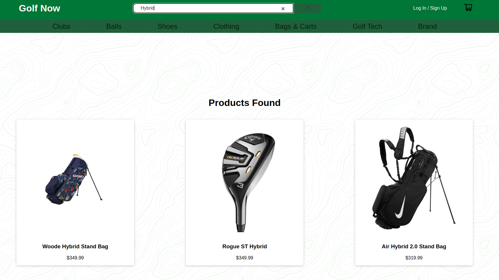
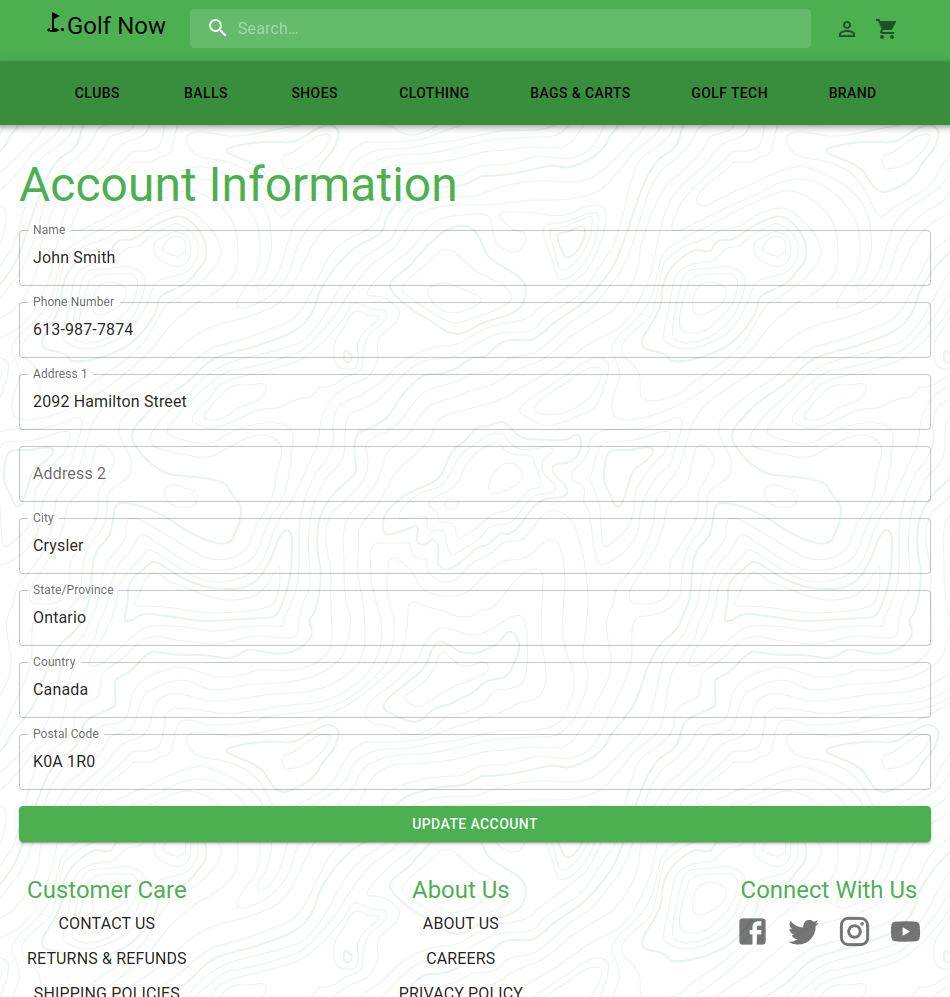
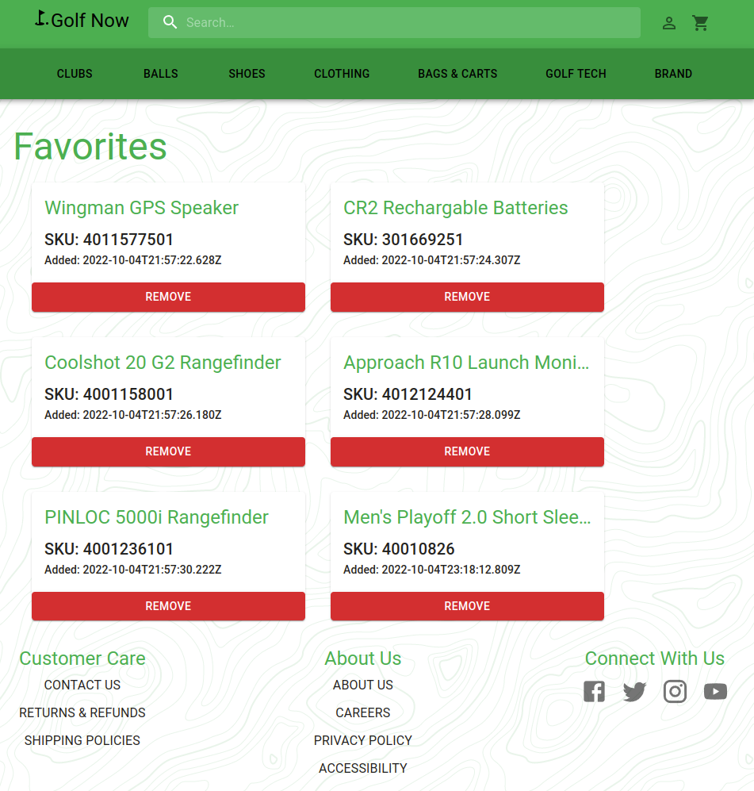
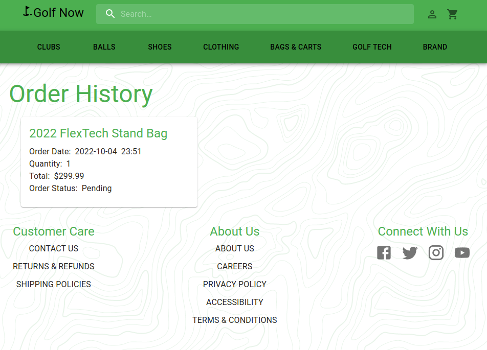

# GolfNow - WIP

An e-commerce website for golf related products. Using NextJS react framework, Stripe for payment, PRISMA for ORM to Postgresql database, Sanity for content management system, NextAuth for user authentication, and Material UI css framework. NodeMailer with Mailtrap used for testing and confirming passwordless email login.

# Dependencies

- @sanity/base: ^2.30.1,
- @sanity/core: ^2.30.2,
- @sanity/default-layout: ^2.30.1,
- @sanity/default-login: ^2.30.1,
- @sanity/desk-tool: ^2.30.1,
- @sanity/eslint-config-studio: ^2.0.0,
- @sanity/vision: ^2.30.1,
- prop-types: ^15.7,
- react: ^17.0,
- react-barcode: ^1.3.2,
- react-dom: ^17.0,
- nodemailer ^6.7.8,
- @mui/material ^5.10.6

# Screenshots

# Getting Started

1. Create the `.env` by using `.env.example` as a reference: `cp .env.example .env`
2. Update the .env file with your correct local information
3. Install dependencies: `npm i`
4. Run the server: `npm run dev`
5. Visit `http://localhost:3000/`

## Sanity Setup and Usage

1. setup an account with sanity
2. grab the sanity token associated with the account
3. populate the token in `.env`
4. will need to restart the server if it is already running

## Stripe Setup and Usage

1. grab stripe publishable key and stripe secret key from you stripe account
2. populate the information in the `.env` file
3. will need to restart the server if it is already running

## NextAuth Setup and Usage

1. Create OAuth credentials in Google
2. grab the Google Client ID and Google Secret Key
3. populate the information in the `.env` file
4. will need to restart the server if it is already running

## Prisma Setup and Usage

1. run `npm i` or `npm install` to install the new packages added to package.json (prisma and @prisma/client)
2. copy `.env.example` to `.env` and fill in the details
3. run `npx prisma init`
4. run `npx prisma migrate dev`
5. run `npm run seed` to populate the database with default user information
6. can run the prisma studio `npx prisma studio` to see the database
